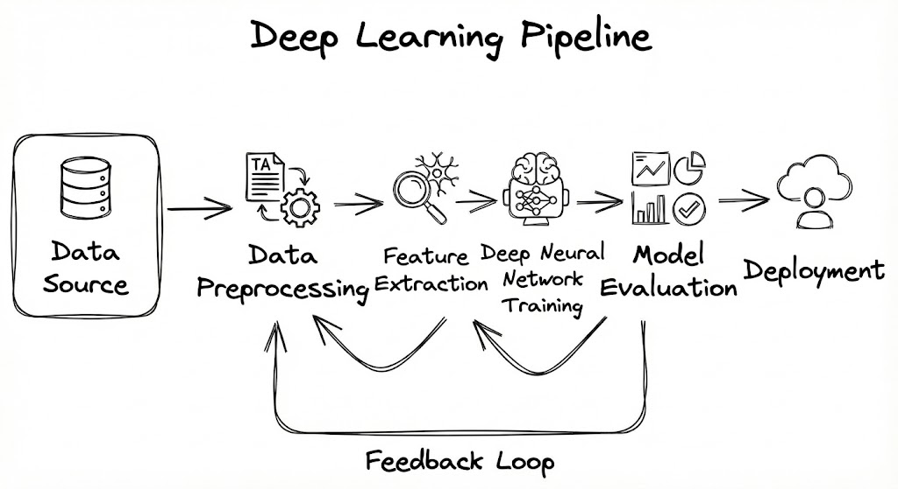
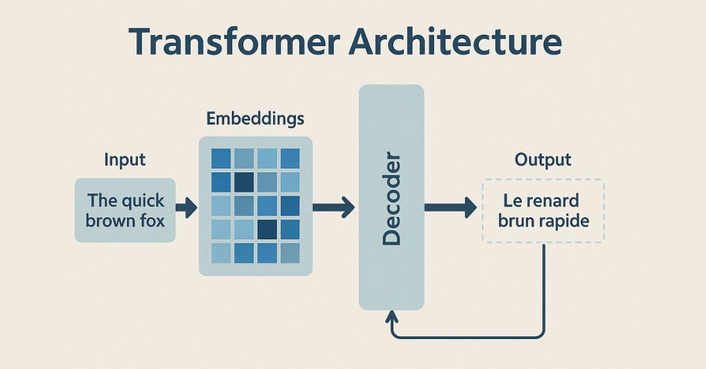
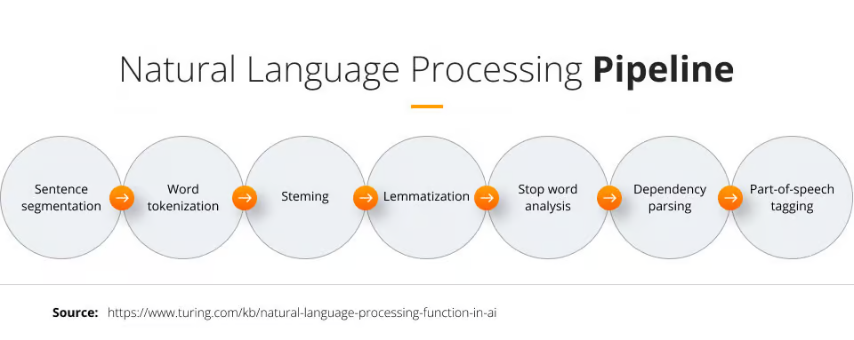

## Overview
This directory will be a  knowledge reference for `Agentic Systems`, Sharing team knowledge and open-source code with diagrams, explaining various concepts and common problems in real-world, from this knowledge reference you will be able to learn agentic systems from the beginning to deploy your Agentic workflow into production. 

> ***Note:** When addressing a real-world problem, LLMs should not be the default choice. Start by identifying the simplest and most effective solution—such as a rule-based system, traditional ML, or deep learning. Only consider LLMs when the problem’s complexity genuinely requires them.*

----------------
## Prerequisites 

### 1. ML

**Machine Learning (ML)**: Is a subset of AI in which system learns patterns from data instead of being explicitly programmed.

**Applications**:
- Email Spam Detection.
- Customers Groups Clustering.
- Recommendation systems

**Sources To Learn:**
1. [Machine Learning Specialization By Andrew Ng.](https://www.youtube.com/playlist?list=PLkDaE6sCZn6FNC6YRfRQc_FbeQrF8BwGI)
2. [Machine Learning Complete Course (Arabic)](https://www.youtube.com/watch?v=GJ9-u3ySTmQ)

### 2. DL

**Deep Learning (DL)** : Is a subset of Machine learning uses **neural networks with many layers** to automatically learn features.

**Applications**: 
- Image recognition
- Speech recognition

**Sources To Learn:**

1. [Deep Learning Crash Course](https://www.youtube.com/watch?v=VyWAvY2CF9c)
2. [Deep Learning Full Course by edureka](https://www.youtube.com/watch?v=DooxDIRAkPA)
3. [Introduction to Artificial Neural Networks and Deep Learning (Arabic)](https://youtube.com/playlist?list=PLhx4zaYkEjI9kTHTV34iQqRcFoO8RvuxV&si=MqKodIpmhOPSbm60)

### 3. Transformers
**Transformers**: Are a **neural network architecture**  presented in (2017) "Attention is all you need".
used to train on a massive text dataset to produce a pretrained model (Encoder or Decoder or Both).

**Applications**:
- Encoder:
	- Text Embeddings (Semantic Search)
	- Token labeling (NER).
	- Classification.
	- Example : BERT Model
- Decoder:
	- Predict next word.
	- Language models like GPT
- Encoder + Decoder:
	- Text summarization 
	- Translation 

**Sources To Learn**:
1. [Transformers by Abu Bakr Soliman](https://www.youtube.com/watch?v=6JGzwI2pNfo&t=3303s)
2. [Transformers by Ahmed ibrahim](https://www.youtube.com/playlist?list=PLyhJeMedQd9R7u-Dcgh1Zs-DjrAecEPm-)
3. [Transformers Visualized by 3Blue1Brown ](https://www.youtube.com/watch?v=wjZofJX0v4M&t=263s)
4. [Transformers by Stanford](https://www.youtube.com/watch?v=Ub3GoFaUcds)

### 4. NLP
**Natural Language Processing**:  Is a field focused in processing human language, Enabling machines to understand and generate text, audio and video.

**Applications**:
- Sentiment Analysis.
- Translation.
- Question answering.
- Information retrieval.

**Sources To Learn**:

