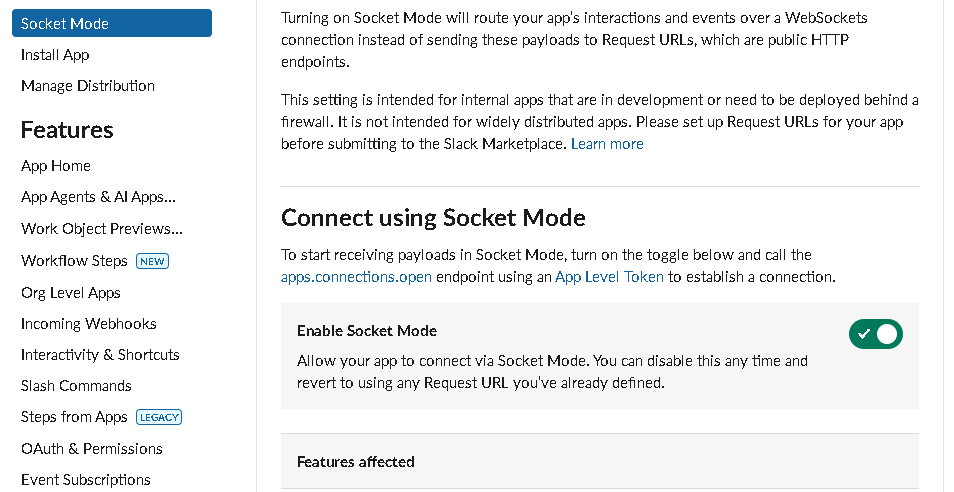
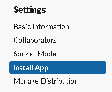

## Overview

this will be a guide to configure your own `slack bot` using python and add it to your workspace.

-------
## 1. Create a slack app

- Go to [slack.api applications](https://api.slack.com/apps)
- Click create New App

 
 
 - Choose **from scratch**.
 - Enter your **App Name** and pick a **Workspace**.

## 2. Configure Scopes 

1. **Bot token scopes**: this scope give the bot permissions on your **Workspace** like 
	- reading 
	- writing
	- managing

*For now I will use only app_mentions:read*

1. **User token scopes**: this score give use permission to control your bot like:
	1. Adding to channel
	2. removing from channel
	3. mention
	4. direct messages.

## 3. Socket Mode

**Enable Socket Mode** : to make your bot interact with outer script using events.
## 4. Event Subscriptions

**Event Subscriptions** Allows you to send `events` to your python code.
when user interacts with the bot in the slack workspace it will send an `event` to your python code.
- Turn on `Enable Events`
- **Add bot User Event**: choose `app_mention`

## 5. Install to workspace

**After finishing these configurations you will need to install your bot to your workspace**

When you are done with installation you will get an `Bot User OAuth Token` which we will use it to handle events in python.

## Create App Token

- go to `Basic information` in the top of your **Settings**
- Generate an **App-Level Token**

**Now you are done** 🥳
- you must have : `Bot User OAuth Token` and `App-Level token`

