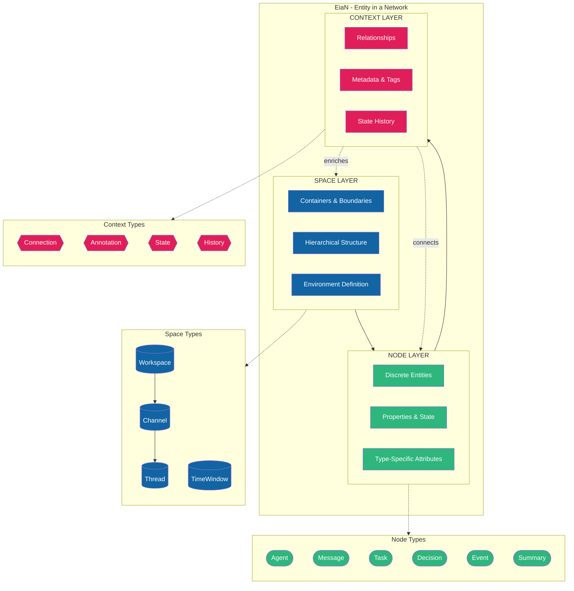

# EiaN Architecture - Three Layer Model

```mermaid
flowchart TB
    subgraph CONCEPT["EiaN - Entity in a Network"]
        direction TB

        subgraph SPACE["SPACE LAYER"]
            direction LR
            S1["Containers & Boundaries"]
            S2["Hierarchical Structure"]
            S3["Environment Definition"]
        end

        subgraph NODE["NODE LAYER"]
            direction LR
            N1["Discrete Entities"]
            N2["Properties & State"]
            N3["Type-Specific Attributes"]
        end

        subgraph CONTEXT["CONTEXT LAYER"]
            direction LR
            C1["Relationships"]
            C2["Metadata & Tags"]
            C3["State History"]
        end

        SPACE --> NODE
        NODE --> CONTEXT
        CONTEXT -.->|"enriches"| SPACE
        CONTEXT -.->|"connects"| NODE
    end

    subgraph SPACE_TYPES["Space Types"]
        direction TB
        WS[("Workspace")]
        CH[("Channel")]
        TH[("Thread")]
        TW[("TimeWindow")]

        WS --> CH
        CH --> TH
    end

    subgraph NODE_TYPES["Node Types"]
        direction TB
        AG(["Agent"])
        MSG(["Message"])
        TSK(["Task"])
        DEC(["Decision"])
        EVT(["Event"])
        SUM(["Summary"])
    end

    subgraph CONTEXT_TYPES["Context Types"]
        direction TB
        CON{{"Connection"}}
        ANN{{"Annotation"}}
        STA{{"State"}}
        HIS{{"History"}}
    end

    SPACE -.-> SPACE_TYPES
    NODE -.-> NODE_TYPES
    CONTEXT -.-> CONTEXT_TYPES

    %% Styling
    classDef spaceStyle fill:#1264A3,color:#fff
    classDef nodeStyle fill:#2EB67D,color:#fff
    classDef contextStyle fill:#E01E5A,color:#fff
    classDef conceptStyle fill:#4A154B,color:#fff

    class S1,S2,S3,WS,CH,TH,TW spaceStyle
    class N1,N2,N3,AG,MSG,TSK,DEC,EVT,SUM nodeStyle
    class C1,C2,C3,CON,ANN,STA,HIS contextStyle
```
