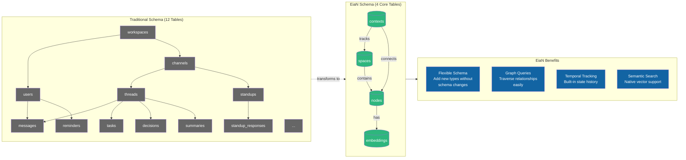

# EiaN vs Traditional Schema Comparison

## Schema Mapping

| Traditional Table | EiaN Equivalent |
|-------------------|-----------------|
| workspaces | `spaces` where `space_type = 'workspace'` |
| channels | `spaces` where `space_type = 'channel'` |
| threads | `spaces` where `space_type = 'thread'` |
| users | `nodes` where `node_type = 'agent'` |
| messages | `nodes` where `node_type = 'message'` |
| tasks | `nodes` where `node_type = 'task'` |
| decisions | `nodes` where `node_type = 'decision'` |
| summaries | `nodes` where `node_type = 'summary'` |
| standups/reminders | `nodes` where `node_type = 'event'` |
| FK relationships | `contexts` where `context_type = 'connection'` |
| status changes | `contexts` where `context_type = 'state'` |
| tags/labels | `contexts` where `context_type = 'annotation'` |
