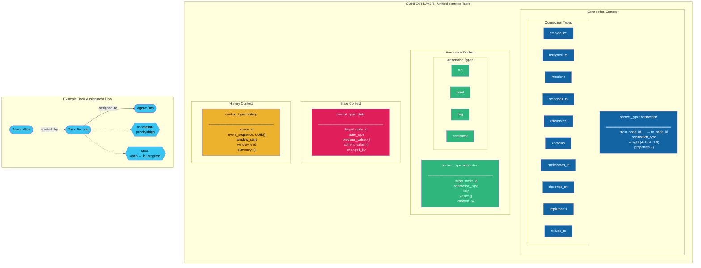

# EiaN Schema - Context Types

```mermaid
flowchart TB
    subgraph CONTEXTS["CONTEXT LAYER - Unified contexts Table"]
        direction TB

        subgraph CONNECTION["Connection Context"]
            direction TB
            CON["context_type: connection
            ═══════════════════════════
            from_node_id ──→ to_node_id
            connection_type
            weight (default: 1.0)
            properties: {}"]

            subgraph CONN_TYPES["Connection Types"]
                CT1["created_by"]
                CT2["assigned_to"]
                CT3["mentions"]
                CT4["responds_to"]
                CT5["references"]
                CT6["contains"]
                CT7["participates_in"]
                CT8["depends_on"]
                CT9["implements"]
                CT10["relates_to"]
            end
        end

        subgraph ANNOTATION["Annotation Context"]
            ANN["context_type: annotation
            ═══════════════════════════
            target_node_id
            annotation_type
            key
            value: {}
            created_by"]

            subgraph ANN_TYPES["Annotation Types"]
                AT1["tag"]
                AT2["label"]
                AT3["flag"]
                AT4["sentiment"]
            end
        end

        subgraph STATE["State Context"]
            STA["context_type: state
            ═══════════════════════════
            target_node_id
            state_type
            previous_value: {}
            current_value: {}
            changed_by"]
        end

        subgraph HISTORY["History Context"]
            HIS["context_type: history
            ═══════════════════════════
            space_id
            event_sequence: UUID[]
            window_start
            window_end
            summary: {}"]
        end
    end

    subgraph EXAMPLE["Example: Task Assignment Flow"]
        direction LR

        U1(["Agent: Alice"])
        T1(["Task: Fix bug"])
        U2(["Agent: Bob"])

        U1 -->|"created_by"| T1
        T1 -->|"assigned_to"| U2

        A1{{"annotation:
        priority=high"}}
        T1 -.-> A1

        S1{{"state:
        open → in_progress"}}
        T1 -.-> S1
    end

    %% Styling
    classDef connection fill:#1264A3,color:#fff
    classDef annotation fill:#2EB67D,color:#fff
    classDef state fill:#E01E5A,color:#fff
    classDef history fill:#ECB22E,color:#000
    classDef example fill:#36C5F0,color:#000

    class CON,CT1,CT2,CT3,CT4,CT5,CT6,CT7,CT8,CT9,CT10 connection
    class ANN,AT1,AT2,AT3,AT4 annotation
    class STA state
    class HIS history
    class U1,U2,T1,A1,S1 example
```
