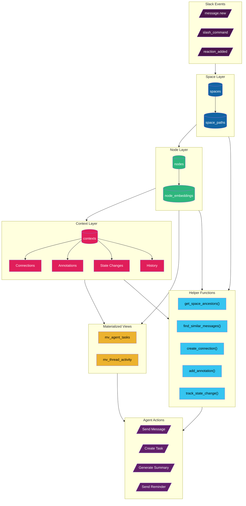

# EiaN Schema - Data Flow

```mermaid
flowchart TB
    subgraph INPUT["Slack Events"]
        SE[/"message.new"/]
        SC[/"slash_command"/]
        SR[/"reaction_added"/]
    end

    subgraph SPACE_LAYER["Space Layer"]
        direction TB
        SP[(spaces)]
        SPP[(space_paths)]

        SP --> SPP
    end

    subgraph NODE_LAYER["Node Layer"]
        direction TB
        ND[(nodes)]
        NE[(node_embeddings)]

        ND --> NE
    end

    subgraph CONTEXT_LAYER["Context Layer"]
        direction TB
        CX[(contexts)]

        CX_CON["Connections"]
        CX_ANN["Annotations"]
        CX_STA["State Changes"]
        CX_HIS["History"]

        CX --> CX_CON
        CX --> CX_ANN
        CX --> CX_STA
        CX --> CX_HIS
    end

    subgraph VIEWS["Materialized Views"]
        MV1["mv_agent_tasks"]
        MV2["mv_thread_activity"]
    end

    subgraph FUNCTIONS["Helper Functions"]
        F1["get_space_ancestors()"]
        F2["find_similar_messages()"]
        F3["create_connection()"]
        F4["add_annotation()"]
        F5["track_state_change()"]
    end

    subgraph OUTPUT["Agent Actions"]
        O1[/"Send Message"/]
        O2[/"Create Task"/]
        O3[/"Generate Summary"/]
        O4[/"Send Reminder"/]
    end

    %% Flow
    INPUT --> SPACE_LAYER
    SPACE_LAYER --> NODE_LAYER
    NODE_LAYER --> CONTEXT_LAYER

    NODE_LAYER --> VIEWS
    CONTEXT_LAYER --> VIEWS

    SPACE_LAYER --> FUNCTIONS
    NODE_LAYER --> FUNCTIONS
    CONTEXT_LAYER --> FUNCTIONS

    VIEWS --> OUTPUT
    FUNCTIONS --> OUTPUT

    %% Styling
    classDef input fill:#4A154B,color:#fff
    classDef space fill:#1264A3,color:#fff
    classDef node fill:#2EB67D,color:#fff
    classDef context fill:#E01E5A,color:#fff
    classDef view fill:#ECB22E,color:#000
    classDef func fill:#36C5F0,color:#000
    classDef output fill:#611f69,color:#fff

    class SE,SC,SR input
    class SP,SPP space
    class ND,NE node
    class CX,CX_CON,CX_ANN,CX_STA,CX_HIS context
    class MV1,MV2 view
    class F1,F2,F3,F4,F5 func
    class O1,O2,O3,O4 output
```
