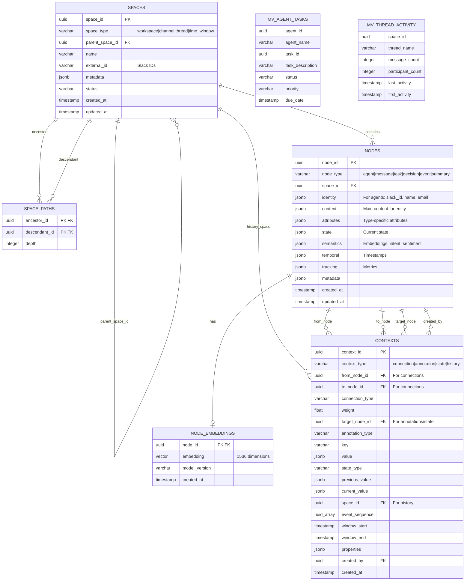

# EiaN Schema - Entity Relationship Diagram

```mermaid
erDiagram
    %% ============================================
    %% EiaN SCHEMA - Entity Relationship Diagram
    %% Space-Nodes-Context Architecture
    %% ============================================

    %% SPACE LAYER
    SPACES {
        uuid space_id PK
        varchar space_type "workspace|channel|thread|time_window"
        uuid parent_space_id FK
        varchar name
        varchar external_id "Slack IDs"
        jsonb metadata
        varchar status
        timestamp created_at
        timestamp updated_at
    }

    SPACE_PATHS {
        uuid ancestor_id PK,FK
        uuid descendant_id PK,FK
        integer depth
    }

    %% NODE LAYER
    NODES {
        uuid node_id PK
        varchar node_type "agent|message|task|decision|event|summary"
        uuid space_id FK
        jsonb identity "For agents: slack_id, name, email"
        jsonb content "Main content for entity"
        jsonb attributes "Type-specific attributes"
        jsonb state "Current state"
        jsonb semantics "Embeddings, intent, sentiment"
        jsonb temporal "Timestamps"
        jsonb tracking "Metrics"
        jsonb metadata
        timestamp created_at
        timestamp updated_at
    }

    NODE_EMBEDDINGS {
        uuid node_id PK,FK
        vector embedding "1536 dimensions"
        varchar model_version
        timestamp created_at
    }

    %% CONTEXT LAYER
    CONTEXTS {
        uuid context_id PK
        varchar context_type "connection|annotation|state|history"
        uuid from_node_id FK "For connections"
        uuid to_node_id FK "For connections"
        varchar connection_type
        float weight
        uuid target_node_id FK "For annotations/state"
        varchar annotation_type
        varchar key
        jsonb value
        varchar state_type
        jsonb previous_value
        jsonb current_value
        uuid space_id FK "For history"
        uuid_array event_sequence
        timestamp window_start
        timestamp window_end
        jsonb properties
        uuid created_by FK
        timestamp created_at
    }

    %% MATERIALIZED VIEWS
    MV_AGENT_TASKS {
        uuid agent_id
        varchar agent_name
        uuid task_id
        varchar task_description
        varchar status
        varchar priority
        timestamp due_date
    }

    MV_THREAD_ACTIVITY {
        uuid space_id
        varchar thread_name
        integer message_count
        integer participant_count
        timestamp last_activity
        timestamp first_activity
    }

    %% RELATIONSHIPS
    SPACES ||--o{ SPACES : "parent_space_id"
    SPACES ||--o{ SPACE_PATHS : "ancestor"
    SPACES ||--o{ SPACE_PATHS : "descendant"
    SPACES ||--o{ NODES : "contains"
    SPACES ||--o{ CONTEXTS : "history_space"

    NODES ||--o| NODE_EMBEDDINGS : "has"
    NODES ||--o{ CONTEXTS : "from_node"
    NODES ||--o{ CONTEXTS : "to_node"
    NODES ||--o{ CONTEXTS : "target_node"
    NODES ||--o{ CONTEXTS : "created_by"
```
