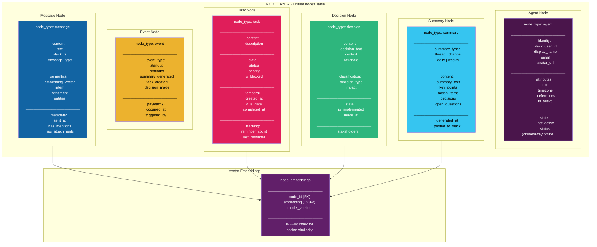

# EiaN Schema - Node Types

```mermaid
flowchart TB
    subgraph NODES["NODE LAYER - Unified nodes Table"]
        direction TB

        subgraph AGENT["Agent Node"]
            AG["node_type: agent
            ─────────────────────
            identity:
              slack_user_id
              display_name
              email
              avatar_url
            ─────────────────────
            attributes:
              role
              timezone
              preferences
              is_active
            ─────────────────────
            state:
              last_active
              status (online/away/offline)"]
        end

        subgraph MESSAGE["Message Node"]
            MSG["node_type: message
            ─────────────────────
            content:
              text
              slack_ts
              message_type
            ─────────────────────
            semantics:
              embedding_vector
              intent
              sentiment
              entities
            ─────────────────────
            metadata:
              sent_at
              has_mentions
              has_attachments"]
        end

        subgraph TASK["Task Node"]
            TSK["node_type: task
            ─────────────────────
            content:
              description
            ─────────────────────
            state:
              status
              priority
              is_blocked
            ─────────────────────
            temporal:
              created_at
              due_date
              completed_at
            ─────────────────────
            tracking:
              reminder_count
              last_reminder"]
        end

        subgraph DECISION["Decision Node"]
            DEC["node_type: decision
            ─────────────────────
            content:
              decision_text
              context
              rationale
            ─────────────────────
            classification:
              decision_type
              impact
            ─────────────────────
            state:
              is_implemented
              made_at
            ─────────────────────
            stakeholders: []"]
        end

        subgraph EVENT["Event Node"]
            EVT["node_type: event
            ─────────────────────
            event_type:
              standup
              reminder
              summary_generated
              task_created
              decision_made
            ─────────────────────
            payload: {}
            occurred_at
            triggered_by"]
        end

        subgraph SUMMARY["Summary Node"]
            SUM["node_type: summary
            ─────────────────────
            summary_type:
              thread | channel
              daily | weekly
            ─────────────────────
            content:
              summary_text
              key_points
              action_items
              decisions
              open_questions
            ─────────────────────
            generated_at
            posted_to_slack"]
        end
    end

    subgraph EMBEDDINGS["Vector Embeddings"]
        EMB["node_embeddings
        ─────────────────────
        node_id (FK)
        embedding (1536d)
        model_version
        ─────────────────────
        IVFFlat Index for
        cosine similarity"]
    end

    MESSAGE --> EMB
    TASK --> EMB
    DECISION --> EMB
    SUMMARY --> EMB

    %% Styling
    classDef agent fill:#4A154B,color:#fff
    classDef message fill:#1264A3,color:#fff
    classDef task fill:#E01E5A,color:#fff
    classDef decision fill:#2EB67D,color:#fff
    classDef event fill:#ECB22E,color:#000
    classDef summary fill:#36C5F0,color:#000
    classDef embed fill:#611f69,color:#fff

    class AG agent
    class MSG message
    class TSK task
    class DEC decision
    class EVT event
    class SUM summary
    class EMB embed
```
