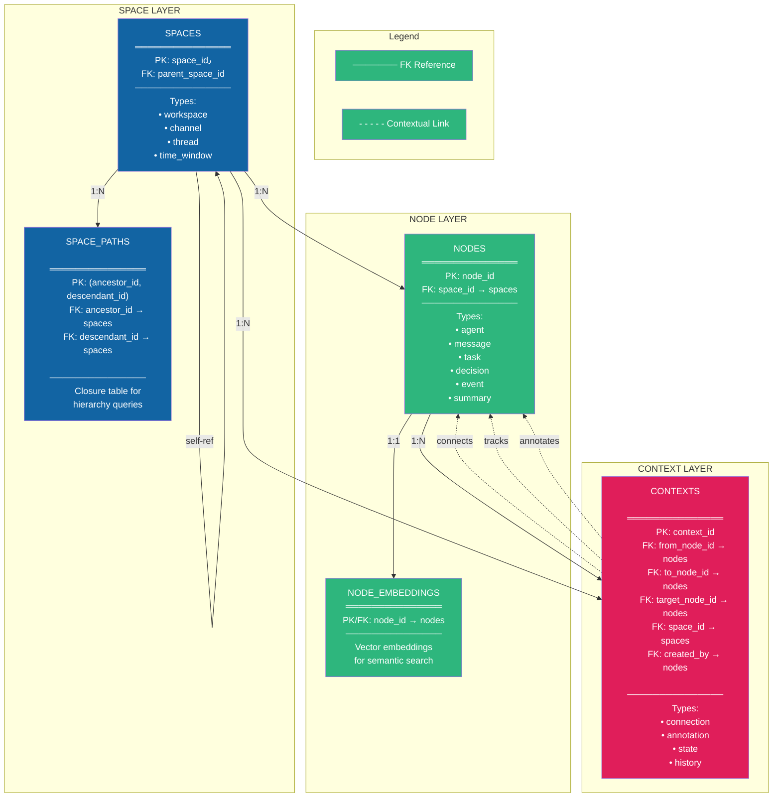

# EiaN Schema - Relationship Map

```mermaid
graph TD
    subgraph LEGEND["Legend"]
        direction LR
        L1["─────── FK Reference"]
        L2["- - - - - Contextual Link"]
    end

    subgraph SPACE_LAYER["SPACE LAYER"]
        SPACES["SPACES
        ═══════════════
        PK: space_id٫
        FK: parent_space_id
        ───────────────
        Types:
        • workspace
        • channel
        • thread
        • time_window"]

        SPACE_PATHS["SPACE_PATHS
        ═══════════════
        PK: (ancestor_id, descendant_id)
        FK: ancestor_id → spaces
        FK: descendant_id → spaces
        ───────────────
        Closure table for
        hierarchy queries"]
    end

    subgraph NODE_LAYER["NODE LAYER"]
        NODES["NODES
        ═══════════════
        PK: node_id
        FK: space_id → spaces
        ───────────────
        Types:
        • agent
        • message
        • task
        • decision
        • event
        • summary"]

        NODE_EMBEDDINGS["NODE_EMBEDDINGS
        ═══════════════
        PK/FK: node_id → nodes
        ───────────────
        Vector embeddings
        for semantic search"]
    end

    subgraph CONTEXT_LAYER["CONTEXT LAYER"]
        CONTEXTS["CONTEXTS
        ═══════════════
        PK: context_id
        FK: from_node_id → nodes
        FK: to_node_id → nodes
        FK: target_node_id → nodes
        FK: space_id → spaces
        FK: created_by → nodes
        ───────────────
        Types:
        • connection
        • annotation
        • state
        • history"]
    end

    %% Relationships
    SPACES -->|"self-ref"| SPACES
    SPACES -->|"1:N"| SPACE_PATHS
    SPACES -->|"1:N"| NODES
    SPACES -->|"1:N"| CONTEXTS

    NODES -->|"1:1"| NODE_EMBEDDINGS
    NODES -->|"1:N"| CONTEXTS

    CONTEXTS -.->|"connects"| NODES
    CONTEXTS -.->|"tracks"| NODES
    CONTEXTS -.->|"annotates"| NODES

    %% Styling
    classDef space fill:#1264A3,color:#fff
    classDef node fill:#2EB67D,color:#fff
    classDef context fill:#E01E5A,color:#fff

    class SPACES,SPACE_PATHS space
    class NODES,NODE_EMBEDDINGS node
    class CONTEXTS context
```
