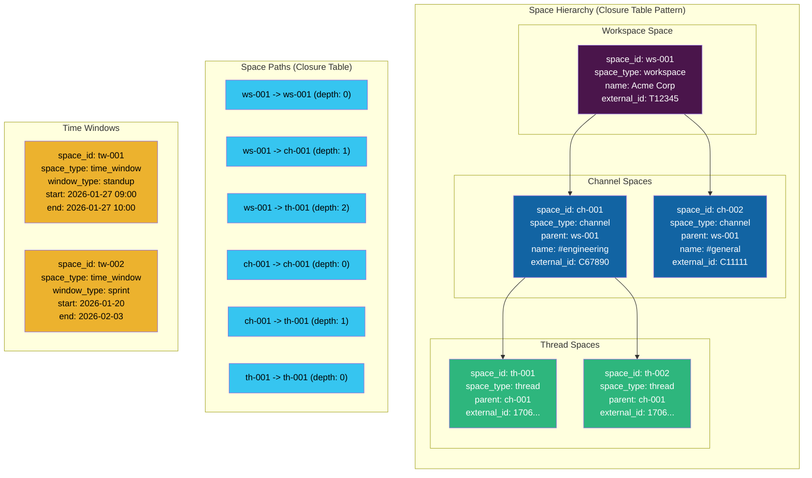

# EiaN Schema - Space Hierarchy

```mermaid
flowchart TB
    subgraph HIERARCHY["Space Hierarchy (Closure Table Pattern)"]
        direction TB

        subgraph WORKSPACE["Workspace Space"]
            W1["space_id: ws-001
            space_type: workspace
            name: Acme Corp
            external_id: T12345"]
        end

        subgraph CHANNELS["Channel Spaces"]
            C1["space_id: ch-001
            space_type: channel
            parent: ws-001
            name: #engineering
            external_id: C67890"]

            C2["space_id: ch-002
            space_type: channel
            parent: ws-001
            name: #general
            external_id: C11111"]
        end

        subgraph THREADS["Thread Spaces"]
            T1["space_id: th-001
            space_type: thread
            parent: ch-001
            external_id: 1706..."]

            T2["space_id: th-002
            space_type: thread
            parent: ch-001
            external_id: 1706..."]
        end

        W1 --> C1
        W1 --> C2
        C1 --> T1
        C1 --> T2
    end

    subgraph PATHS["Space Paths (Closure Table)"]
        direction LR
        P1["ws-001 -> ws-001 (depth: 0)"]
        P2["ws-001 -> ch-001 (depth: 1)"]
        P3["ws-001 -> th-001 (depth: 2)"]
        P4["ch-001 -> ch-001 (depth: 0)"]
        P5["ch-001 -> th-001 (depth: 1)"]
        P6["th-001 -> th-001 (depth: 0)"]
    end

    subgraph TIME_WINDOWS["Time Windows"]
        TW1["space_id: tw-001
        space_type: time_window
        window_type: standup
        start: 2026-01-27 09:00
        end: 2026-01-27 10:00"]

        TW2["space_id: tw-002
        space_type: time_window
        window_type: sprint
        start: 2026-01-20
        end: 2026-02-03"]
    end

    %% Styling
    classDef workspace fill:#4A154B,color:#fff
    classDef channel fill:#1264A3,color:#fff
    classDef thread fill:#2EB67D,color:#fff
    classDef timewindow fill:#ECB22E,color:#000
    classDef paths fill:#36C5F0,color:#000

    class W1 workspace
    class C1,C2 channel
    class T1,T2 thread
    class TW1,TW2 timewindow
    class P1,P2,P3,P4,P5,P6 paths
```
