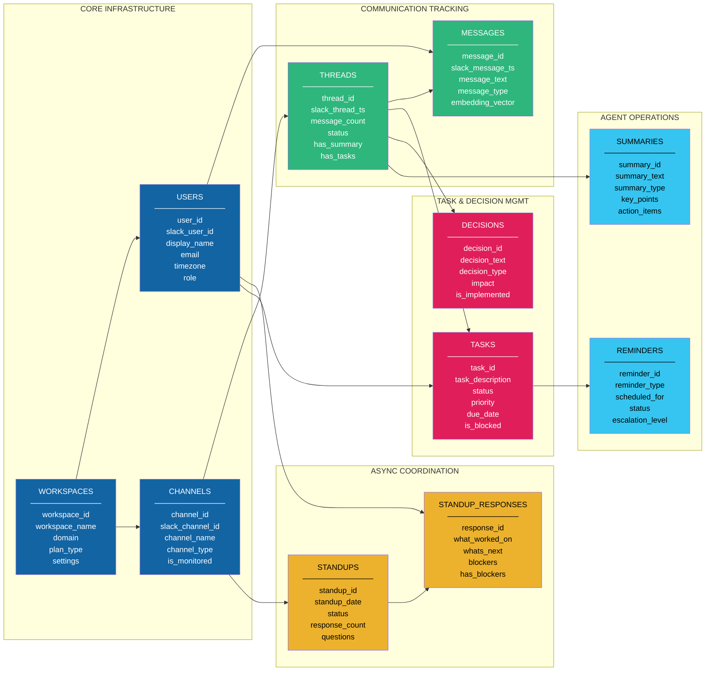

# Slack Agent - Component Overview

```mermaid
flowchart LR
    %% ============================================
    %% SLACK AGENT SCHEMA - Component Overview
    %% ============================================

    subgraph INFRA["CORE INFRASTRUCTURE"]
        direction TB
        W["WORKSPACES
        ─────────────
        workspace_id
        workspace_name
        domain
        plan_type
        settings"]

        U["USERS
        ─────────────
        user_id
        slack_user_id
        display_name
        email
        timezone
        role"]

        C["CHANNELS
        ─────────────
        channel_id
        slack_channel_id
        channel_name
        channel_type
        is_monitored"]

        W --> U
        W --> C
    end

    subgraph TRACKING["COMMUNICATION TRACKING"]
        direction TB
        T["THREADS
        ─────────────
        thread_id
        slack_thread_ts
        message_count
        status
        has_summary
        has_tasks"]

        M["MESSAGES
        ─────────────
        message_id
        slack_message_ts
        message_text
        message_type
        embedding_vector"]

        T --> M
    end

    subgraph COORD["ASYNC COORDINATION"]
        direction TB
        S["STANDUPS
        ─────────────
        standup_id
        standup_date
        status
        response_count
        questions"]

        SR["STANDUP_RESPONSES
        ─────────────
        response_id
        what_worked_on
        whats_next
        blockers
        has_blockers"]

        S --> SR
    end

    subgraph MGMT["TASK & DECISION MGMT"]
        direction TB
        TA["TASKS
        ─────────────
        task_id
        task_description
        status
        priority
        due_date
        is_blocked"]

        D["DECISIONS
        ─────────────
        decision_id
        decision_text
        decision_type
        impact
        is_implemented"]
    end

    subgraph OPS["AGENT OPERATIONS"]
        direction TB
        SUM["SUMMARIES
        ─────────────
        summary_id
        summary_text
        summary_type
        key_points
        action_items"]

        R["REMINDERS
        ─────────────
        reminder_id
        reminder_type
        scheduled_for
        status
        escalation_level"]
    end

    %% Cross-component relationships
    C --> T
    C --> S
    T --> TA
    T --> D
    T --> SUM
    U --> M
    U --> SR
    U --> TA
    TA --> R

    %% Styling
    classDef infra fill:#1264A3,color:#fff
    classDef tracking fill:#2EB67D,color:#fff
    classDef coord fill:#ECB22E,color:#000
    classDef mgmt fill:#E01E5A,color:#fff
    classDef ops fill:#36C5F0,color:#000

    class W,U,C infra
    class T,M tracking
    class S,SR coord
    class TA,D mgmt
    class SUM,R ops
```
