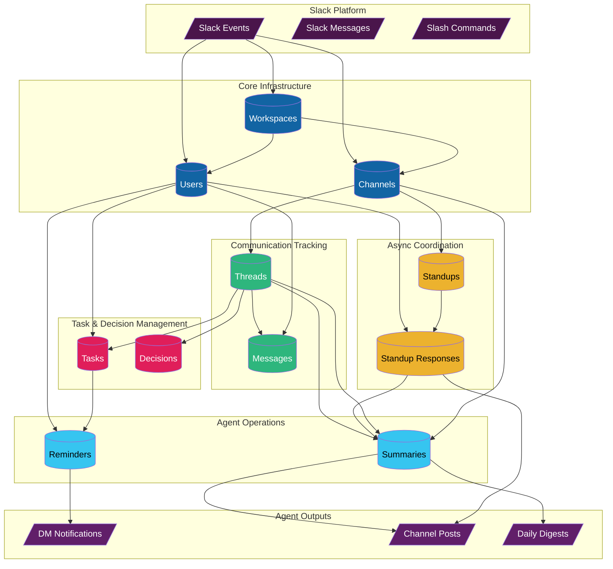

# Slack Agent - Data Flow Diagram

```mermaid
flowchart TB
    %% ============================================
    %% SLACK AGENT SCHEMA - Data Flow Diagram
    %% ============================================

    subgraph SLACK["Slack Platform"]
        SE[/"Slack Events"/]
        SM[/"Slack Messages"/]
        SC[/"Slash Commands"/]
    end

    subgraph CORE["Core Infrastructure"]
        WS[(Workspaces)]
        US[(Users)]
        CH[(Channels)]
    end

    subgraph COMMS["Communication Tracking"]
        TH[(Threads)]
        MSG[(Messages)]
    end

    subgraph ASYNC["Async Coordination"]
        ST[(Standups)]
        SR[(Standup Responses)]
    end

    subgraph MGMT["Task & Decision Management"]
        TA[(Tasks)]
        DE[(Decisions)]
    end

    subgraph OPS["Agent Operations"]
        SU[(Summaries)]
        RE[(Reminders)]
    end

    subgraph OUTPUT["Agent Outputs"]
        DN[/"DM Notifications"/]
        CP[/"Channel Posts"/]
        DG[/"Daily Digests"/]
    end

    %% Slack to Core
    SE --> WS
    SE --> US
    SE --> CH

    %% Core relationships
    WS --> US
    WS --> CH

    %% Channel to Communications
    CH --> TH
    CH --> ST

    %% Thread relationships
    TH --> MSG
    TH --> TA
    TH --> DE
    TH --> SU

    %% User interactions
    US --> MSG
    US --> SR
    US --> TA
    US --> RE

    %% Standup flow
    ST --> SR
    SR --> SU

    %% Task flow
    TA --> RE

    %% Thread to Summaries
    TH --> SU
    CH --> SU

    %% Agent outputs
    SU --> CP
    SU --> DG
    RE --> DN
    SR --> CP

    %% Styling
    classDef slack fill:#4A154B,color:#fff
    classDef core fill:#1264A3,color:#fff
    classDef comms fill:#2EB67D,color:#fff
    classDef async fill:#ECB22E,color:#000
    classDef mgmt fill:#E01E5A,color:#fff
    classDef ops fill:#36C5F0,color:#000
    classDef output fill:#611f69,color:#fff

    class SE,SM,SC slack
    class WS,US,CH core
    class TH,MSG comms
    class ST,SR async
    class TA,DE mgmt
    class SU,RE ops
    class DN,CP,DG output
```
