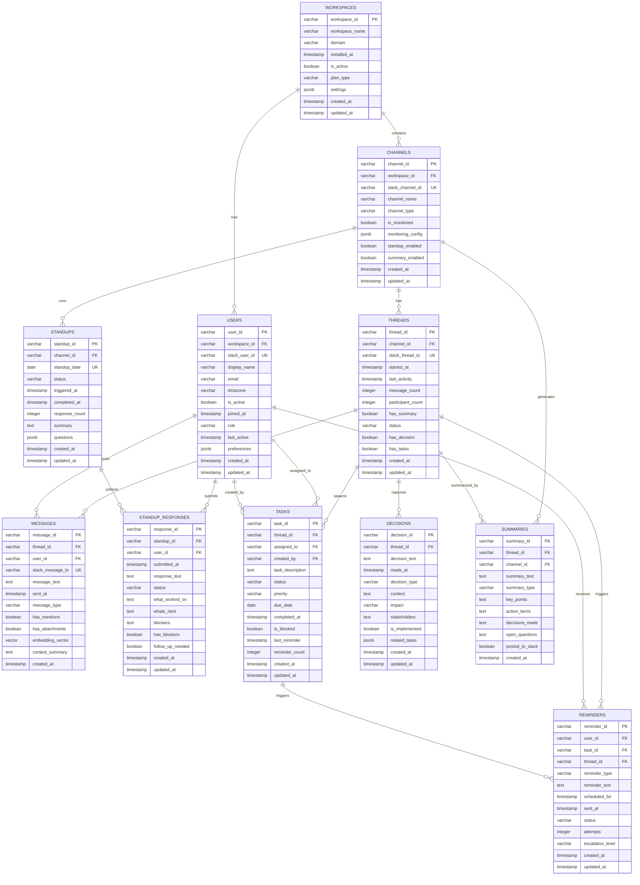

# Slack Agent - Entity Relationship Diagram

```mermaid
erDiagram
    %% ============================================
    %% SLACK AGENT SCHEMA - Entity Relationship Diagram
    %% ============================================

    %% CORE INFRASTRUCTURE
    WORKSPACES {
        varchar workspace_id PK
        varchar workspace_name
        varchar domain
        timestamp installed_at
        boolean is_active
        varchar plan_type
        jsonb settings
        timestamp created_at
        timestamp updated_at
    }

    USERS {
        varchar user_id PK
        varchar workspace_id FK
        varchar slack_user_id UK
        varchar display_name
        varchar email
        varchar timezone
        boolean is_active
        timestamp joined_at
        varchar role
        timestamp last_active
        jsonb preferences
        timestamp created_at
        timestamp updated_at
    }

    CHANNELS {
        varchar channel_id PK
        varchar workspace_id FK
        varchar slack_channel_id UK
        varchar channel_name
        varchar channel_type
        boolean is_monitored
        jsonb monitoring_config
        boolean standup_enabled
        boolean summary_enabled
        timestamp created_at
        timestamp updated_at
    }

    %% COMMUNICATION TRACKING
    THREADS {
        varchar thread_id PK
        varchar channel_id FK
        varchar slack_thread_ts UK
        timestamp started_at
        timestamp last_activity
        integer message_count
        integer participant_count
        boolean has_summary
        varchar status
        boolean has_decision
        boolean has_tasks
        timestamp created_at
        timestamp updated_at
    }

    MESSAGES {
        varchar message_id PK
        varchar thread_id FK
        varchar user_id FK
        varchar slack_message_ts UK
        text message_text
        timestamp sent_at
        varchar message_type
        boolean has_mentions
        boolean has_attachments
        vector embedding_vector
        text context_summary
        timestamp created_at
    }

    %% ASYNC COORDINATION
    STANDUPS {
        varchar standup_id PK
        varchar channel_id FK
        date standup_date UK
        varchar status
        timestamp triggered_at
        timestamp completed_at
        integer response_count
        text summary
        jsonb questions
        timestamp created_at
        timestamp updated_at
    }

    STANDUP_RESPONSES {
        varchar response_id PK
        varchar standup_id FK
        varchar user_id FK
        timestamp submitted_at
        text response_text
        varchar status
        text what_worked_on
        text whats_next
        text blockers
        boolean has_blockers
        boolean follow_up_needed
        timestamp created_at
        timestamp updated_at
    }

    %% TASK & DECISION MANAGEMENT
    TASKS {
        varchar task_id PK
        varchar thread_id FK
        varchar assigned_to FK
        varchar created_by FK
        text task_description
        varchar status
        varchar priority
        date due_date
        timestamp completed_at
        boolean is_blocked
        timestamp last_reminder
        integer reminder_count
        timestamp created_at
        timestamp updated_at
    }

    DECISIONS {
        varchar decision_id PK
        varchar thread_id FK
        text decision_text
        timestamp made_at
        varchar decision_type
        text context
        varchar impact
        text stakeholders
        boolean is_implemented
        jsonb related_tasks
        timestamp created_at
        timestamp updated_at
    }

    %% AGENT OPERATIONS
    SUMMARIES {
        varchar summary_id PK
        varchar thread_id FK
        varchar channel_id FK
        text summary_text
        varchar summary_type
        text key_points
        text action_items
        text decisions_made
        text open_questions
        boolean posted_to_slack
        timestamp created_at
    }

    REMINDERS {
        varchar reminder_id PK
        varchar user_id FK
        varchar task_id FK
        varchar thread_id FK
        varchar reminder_type
        text reminder_text
        timestamp scheduled_for
        timestamp sent_at
        varchar status
        integer attempts
        varchar escalation_level
        timestamp created_at
        timestamp updated_at
    }

    %% RELATIONSHIPS
    WORKSPACES ||--o{ USERS : "has"
    WORKSPACES ||--o{ CHANNELS : "contains"

    CHANNELS ||--o{ THREADS : "has"
    CHANNELS ||--o{ STANDUPS : "runs"
    CHANNELS ||--o{ SUMMARIES : "generates"

    THREADS ||--o{ MESSAGES : "contains"
    THREADS ||--o{ TASKS : "spawns"
    THREADS ||--o{ DECISIONS : "captures"
    THREADS ||--o{ SUMMARIES : "summarized_by"
    THREADS ||--o{ REMINDERS : "triggers"

    USERS ||--o{ MESSAGES : "sends"
    USERS ||--o{ STANDUP_RESPONSES : "submits"
    USERS ||--o{ TASKS : "assigned_to"
    USERS ||--o{ TASKS : "created_by"
    USERS ||--o{ REMINDERS : "receives"

    STANDUPS ||--o{ STANDUP_RESPONSES : "collects"

    TASKS ||--o{ REMINDERS : "triggers"
```
