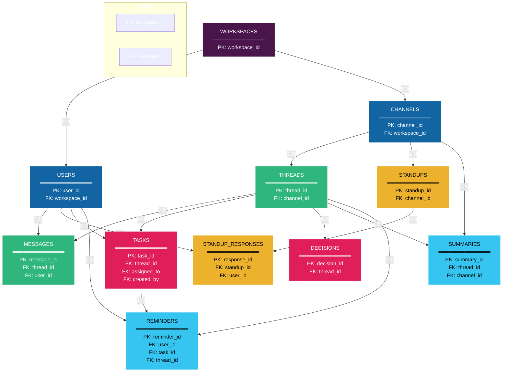

# Slack Agent - Relationship Map

```mermaid
graph TD
    %% ============================================
    %% SLACK AGENT SCHEMA - Relationship Map
    %% ============================================

    subgraph legend["Legend"]
        direction LR
        L1["1:N Relationship"]
        L2["FK Reference"]
    end

    %% WORKSPACES - Root Entity
    WORKSPACES["WORKSPACES
    ══════════════
    PK: workspace_id"]

    %% USERS
    USERS["USERS
    ══════════════
    PK: user_id
    FK: workspace_id"]

    %% CHANNELS
    CHANNELS["CHANNELS
    ══════════════
    PK: channel_id
    FK: workspace_id"]

    %% THREADS
    THREADS["THREADS
    ══════════════
    PK: thread_id
    FK: channel_id"]

    %% MESSAGES
    MESSAGES["MESSAGES
    ══════════════
    PK: message_id
    FK: thread_id
    FK: user_id"]

    %% STANDUPS
    STANDUPS["STANDUPS
    ══════════════
    PK: standup_id
    FK: channel_id"]

    %% STANDUP_RESPONSES
    STANDUP_RESPONSES["STANDUP_RESPONSES
    ══════════════
    PK: response_id
    FK: standup_id
    FK: user_id"]

    %% TASKS
    TASKS["TASKS
    ══════════════
    PK: task_id
    FK: thread_id
    FK: assigned_to
    FK: created_by"]

    %% DECISIONS
    DECISIONS["DECISIONS
    ══════════════
    PK: decision_id
    FK: thread_id"]

    %% SUMMARIES
    SUMMARIES["SUMMARIES
    ══════════════
    PK: summary_id
    FK: thread_id
    FK: channel_id"]

    %% REMINDERS
    REMINDERS["REMINDERS
    ══════════════
    PK: reminder_id
    FK: user_id
    FK: task_id
    FK: thread_id"]

    %% Relationships from WORKSPACES
    WORKSPACES -->|"1:N"| USERS
    WORKSPACES -->|"1:N"| CHANNELS

    %% Relationships from CHANNELS
    CHANNELS -->|"1:N"| THREADS
    CHANNELS -->|"1:N"| STANDUPS
    CHANNELS -->|"1:N"| SUMMARIES

    %% Relationships from THREADS
    THREADS -->|"1:N"| MESSAGES
    THREADS -->|"1:N"| TASKS
    THREADS -->|"1:N"| DECISIONS
    THREADS -->|"1:N"| SUMMARIES
    THREADS -->|"1:N"| REMINDERS

    %% Relationships from USERS
    USERS -->|"1:N"| MESSAGES
    USERS -->|"1:N"| STANDUP_RESPONSES
    USERS -->|"1:N"| TASKS
    USERS -->|"1:N"| REMINDERS

    %% Relationships from STANDUPS
    STANDUPS -->|"1:N"| STANDUP_RESPONSES

    %% Relationships from TASKS
    TASKS -->|"1:N"| REMINDERS

    %% Styling
    classDef root fill:#4A154B,color:#fff,stroke:#4A154B
    classDef core fill:#1264A3,color:#fff,stroke:#1264A3
    classDef comm fill:#2EB67D,color:#fff,stroke:#2EB67D
    classDef async fill:#ECB22E,color:#000,stroke:#ECB22E
    classDef mgmt fill:#E01E5A,color:#fff,stroke:#E01E5A
    classDef ops fill:#36C5F0,color:#000,stroke:#36C5F0

    class WORKSPACES root
    class USERS,CHANNELS core
    class THREADS,MESSAGES comm
    class STANDUPS,STANDUP_RESPONSES async
    class TASKS,DECISIONS mgmt
    class SUMMARIES,REMINDERS ops
```
