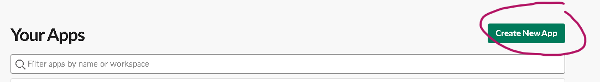
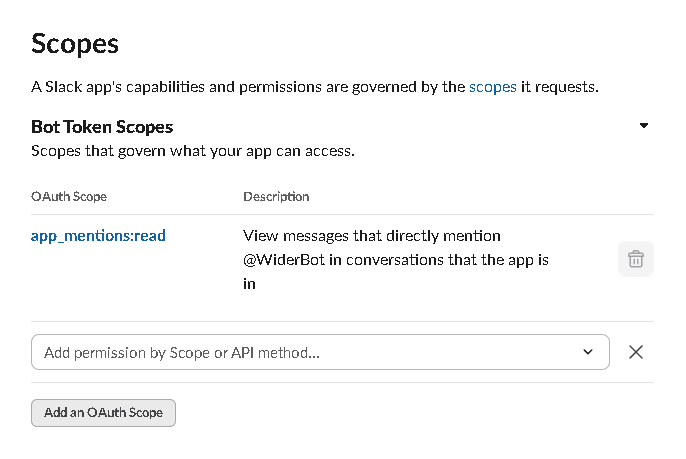
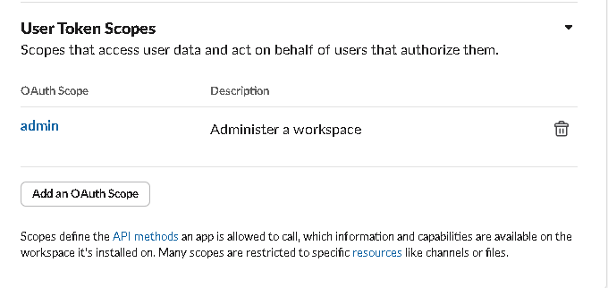
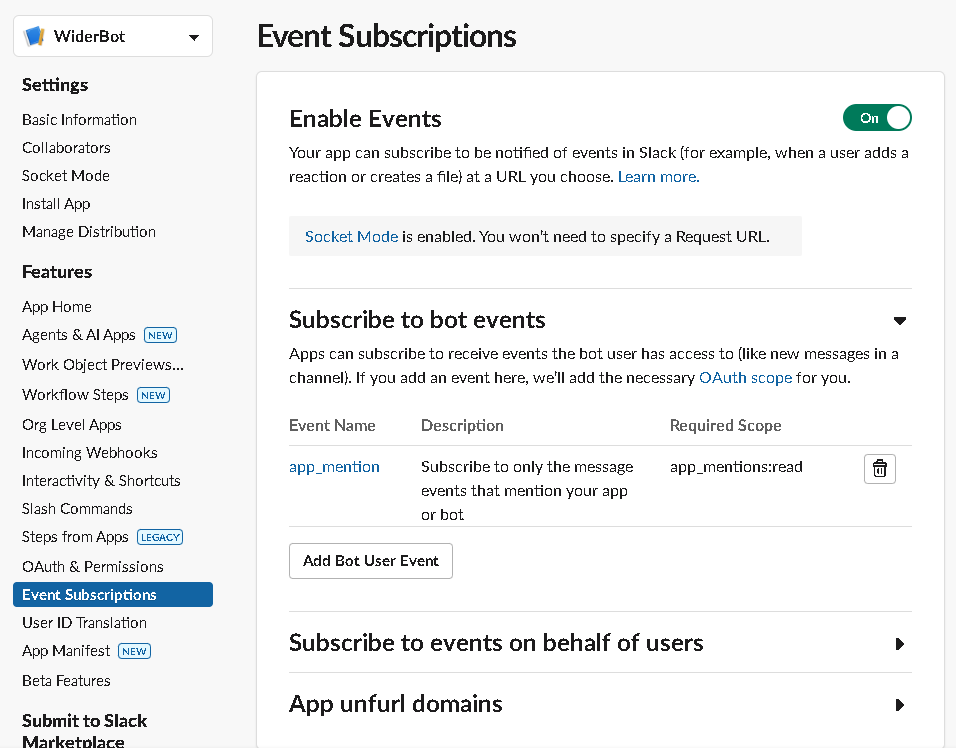

## Overview
this will be a guide to configure your own `slack bot` using python and add it to your workspace.

-------
## 1. Create a slack app
- Go to [slack.api applications](https://api.slack.com/apps)
- Click create New App
 
 - Choose **from scratch**.
 - Enter your **App Name** and pick a **Workspace**.

## 2. Configure Scopes 
1. **Bot token scopes**: this scope give the bot permissions on your **Workspace** like 
	- reading 
	- writing
	- managing

*For now I will use only app_mentions:read*

1. **User token scopes**: this score give use permission to control your bot like:
	1. Adding to channel
	2. removing from channel
	3. mention
	4. direct messages.

## 3. Event Subscriptions

**Event Subscriptions** Allows you to send `events` to your python code.
when user interacts with the bot in the slack workspace it will send an event to your python code.